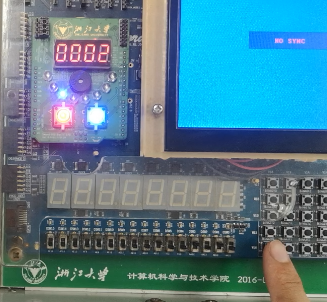

# 实验 4 ：单周期CPU设计

[toc]

## Part 1 基本信息

### 小组成员信息

| 序号 |  姓名  |    学号    |
| :--: | :----: | :--------: |
|  1   | 钟添芸 | 3180103009 |
|  2   | 江昊瀚 | 3180101995 |
|  3   |  徐震  | 3180105004 |
|  4   | 麦昌楷 | 3180101982 |

### 声明

* 本工程目标平台与物理测试平台为Sword Kintex7实验平台
* 本工程主要代码采用Verilog编写，同时辅助有Schematic图形
* 本工程综合编译环境为ISE-14.7 (nt64)
* 本工程Simulation环境为Windows10 (64bit)

### 工程哈希

6be1cb7127e3a22087181a97c37d3d02

## Part 2 实验目的及原理

### 实验目的

1. 实现一个单周期CPU，提供对MIPS常见指令集的支持，包括部分R型语句、lw、sw、beq以及j语句。
2. 在实验板上验证该单周期CPU的正确性。

### 译码真值表

#### 主控制模块

##### 指令类型译码

| 信号  | R型  |  lw  |  sw  | beq  |  j   |
| :---: | :--: | :--: | :--: | :--: | :--: |
| OP[5] |  0   |  1   |  1   |  0   |  0   |
| OP[4] |  0   |  0   |  0   |  0   |  0   |
| OP[3] |  0   |  0   |  1   |  0   |  0   |
| OP[2] |  0   |  0   |  0   |  1   |  0   |
| OP[1] |  0   |  1   |  1   |  0   |  1   |
| OP[0] |  0   |  1   |  1   |  0   |  0   |

##### 控制信号译码

| 指令类型 | RegDst | ALUsrc | MemtoReg | RegWrite | MemWrite | MemRead | Branch | Jump | ALUop |
| :------: | :----: | :----: | :------: | :------: | :------: | :-----: | :----: | :--: | :---: |
|    R     |   1    |   0    |    0     |    1     |    0     |    0    |   0    |  0   |  10   |
|    lw    |   0    |   1    |    1     |    1     |    0     |    1    |   0    |  0   |  00   |
|    sw    |   x    |   1    |    x     |    0     |    1     |    0    |   0    |  0   |  00   |
|   beq    |   x    |   0    |    x     |    0     |    0     |    0    |   1    |  0   |  01   |
|    j     |   x    |   x    |    x     |    x     |    x     |    x    |   x    |  1   |  xx   |

#### ALU控制模块

##### ALU操作类型译码

|  操作   | ALUop[1] | ALUop[0] | FUNC[5] | FUNC[4] | FUNC[3] | FUNC[2] | FUNC[1] | FUNC[0] |
| :-----: | :------: | :------: | :-----: | :-----: | :-----: | :-----: | :-----: | :-----: |
|   加    |    0     |    0     |    x    |    x    |    x    |    x    |    x    |    x    |
|   减    |    x     |    1     |    x    |    x    |    x    |    x    |    x    |    x    |
|   加    |    1     |    x     |    x    |    x    |    0    |    0    |    0    |    0    |
|   减    |    1     |    x     |    x    |    x    |    0    |    0    |    1    |    0    |
|   与    |    1     |    x     |    x    |    x    |    0    |    1    |    0    |    0    |
|   或    |    1     |    x     |    x    |    x    |    0    |    1    |    0    |    1    |
| 小于置1 |    1     |    x     |    x    |    x    |    1    |    0    |    1    |    0    |

##### ALU控制信号译码

|  操作   | OP[3] | OP[2] | OP[1] | OP[0] |
| :-----: | :---: | :---: | :---: | :---: |
|   加    |   0   |   0   |   1   |   0   |
|   减    |   0   |   1   |   1   |   0   |
|   与    |   0   |   0   |   0   |   0   |
|   或    |   0   |   0   |   0   |   1   |
| 小于置1 |   0   |   1   |   1   |   1   |

### 组织结构图


## Part 3 模块实现

### 主要功能模块

#### N位二选一模块 single_mux #(N)

该模块接受两个N位的信号，通过控制信号选择其中一个输出。

```verilog
module single_mux(
	A,
	B,
	Ctrl,
	S
   );
	
	parameter N = 32;          //默认输入输出宽度为32位，可调整
	input  wire Ctrl;          //控制信号
    input  wire [N-1:0] A, B;  //输入
    output wire [N-1:0] S;     //输出
	
    assign S = (Ctrl == 1'b0) ? A : B; //控制信号置0时输出A，置1时输出B
	
endmodule
```

#### 32位加法器模块 single_add #(N)

该模块接受两个32位的输入，并输出它们的和，用于计算beq指令的跳转地址

```verilog
module single_add(
	i_op1,
	i_op2,
	o_out
    );
	 
    input  wire [31:0] i_op1, i_op2; //两个输入
    output wire [31:0] o_out;        //输出它们的和
	
	assign o_out = i_op1 + i_op2; //单纯的加法

endmodule
```

#### PC程序计数器模块 single_pc #(N)

该模块实现程序计数器的功能，有一个参数N

```verilog
module single_pc(
	i_pc,
	o_pc,
	clk,
	rst
    );

	parameter N = 32;                     //参数，决定了程序计数器的位数

	input wire clk, rst;                  //时钟信号与复位信号
    input  wire [N-1:0] i_pc;             //新的PC
    output wire [N-1:0] o_pc;             //当前的PC
    reg [N-1:0] t_pc;                     //存放当前PC的寄存器
	
    assign o_pc = rst ? {N{1'b1}} : t_pc; //重置信号将PC重置到-1，这样，读取指令使用的PC将从0开始
	
    always @(posedge clk)                 //每个时钟周期，更新程序计数器
		t_pc <=  i_pc;

endmodule
```

#### PC+4模块 single_pc_plus_4

```verilog
module single_pc_plus_4(
	i_pc,
	o_pc
    );

	parameter N = 32;
	
    input wire [N-1:0] i_pc;  //输入：PC
    output wire [N-1:0] o_pc; //输出：PC+4
	
	assign o_pc = i_pc + 1;   //由于我们的存储器使用字地址，因此不需要+4，而是使用+1

endmodule
```

#### 寄存器堆模块 single_gpr

这个模块中提供对32个寄存器的读写方法，并且提供一个额外的用于测试的接口。

```verilog
module single_gpr(
	clk, rst,
	i_addr1, i_addr2, i_addr3, 
	i_wreg,  i_wdata, i_wen,
	o_op1,   o_op2,   o_op3
    );
	 
	input  wire clk, rst, i_wen;                          //时钟信号、复位信号和写入使能信号
    input  wire [ 4:0] i_addr1, i_addr2, i_addr3, i_wreg; //三个读取地址，一个写入地址
    input  wire [31:0] i_wdata;                           //写入的数据
    output wire [31:0] o_op1, o_op2, o_op3;               //读取的数据

	reg  [31:0] mem[31:0];
	
    assign o_op1 = mem[i_addr1]; //通过addr信号提供的地址直接取出对应的寄存器中的数据
	assign o_op2 = mem[i_addr2];
	assign o_op3 = mem[i_addr3];
	
	always @(posedge clk or posedge rst)
        if (rst == 1'b1) mem[0] = {32{1'b0}}; //复位时，将$zero重置为0x00000000
    else if (i_wen) mem[i_wreg] = (i_wreg == {5{1'b0}}) ? {32{1'b0}} : i_wdata; //$zero寄存器无法被写入

endmodule
```

#### 控制模块 single_ctrl

该模块对指令INS[31:26]段译码，得到指令类型并输出各种控制信号

```verilog
module single_ctrl(
	OP,
	ALUop,
	RegDst,
	RegWrite,
	Branch,
	Jump,
	MemtoReg,
	MemRead,
	MemWrite,
	ALUsrc,
	rst,
	LED
    );
	 
	input  wire       rst;   //复位信号
    input  wire [5:0] OP;    //操作码
    
    //输出各种控制信号
    output wire [1:0] ALUop; //ALU控制模块的二次译码信号
	output wire RegDst, RegWrite, Branch, Jump, MemtoReg, MemRead, MemWrite, ALUsrc;
    output wire [4:0] LED;   //将指令类型通过LED信号进行输出
	
	wire R, LW, SW, BEQ;
	
    //对指令类型进行译码
	assign R   = ~OP[0] & ~OP[1] & ~OP[2] & ~OP[3] & ~OP[4] & ~OP[5];
	assign LW  =  OP[0] &  OP[1] & ~OP[2] & ~OP[3] & ~OP[4] &  OP[5];
	assign SW  =  OP[0] &  OP[1] & ~OP[2] &  OP[3] & ~OP[4] &  OP[5];
	assign BEQ = ~OP[0] & ~OP[1] &  OP[2] & ~OP[3] & ~OP[4] & ~OP[5];
	assign J   = ~OP[0] &  OP[1] & ~OP[2] & ~OP[3] & ~OP[4] & ~OP[5];
	
    //将指令类型的译码结果通过LED进行输出
	assign LED = {J, BEQ, LW, SW, R};

    //知道指令类型之后，可以参照真值表对各种信号进行译码
	assign RegDst = ~rst & R;
	assign ALUsrc = ~rst & SW | LW;
	assign MemtoReg = ~rst & LW;
	assign RegWrite = ~rst & R | LW;
	assign MemRead = ~rst & LW;
	assign MemWrite = ~rst & SW;
	assign Branch = ~rst & BEQ;
	assign ALUop = ~rst & {R, BEQ};
	assign Jump = ~rst & J;
	
endmodule
```

#### ALU控制模块 single_alu_ctrl

该模块利用控制模块提供的ALUop以及指令INS[5:0]段进行二次译码，输出ALU模块的操作码。

```verilog
module single_alu_ctrl(
	ALUop,
	FUNC,
	OP
    );

	input wire  [1:0] ALUop;
	input wire  [5:0] FUNC;
	output wire [3:0] OP;
	
	wire LS, BEQ, R;
	wire OP_ADD, OP_SUB, OP_AND, OP_OR, OP_SLT;
	
    //利用ALUop得到指令类型
	assign LS  = ~ALUop[0] & ~ALUop[1];
	assign BEQ =  ALUop[0] & ~ALUop[1];
	assign R   = ~ALUop[0] &  ALUop[1];

    //得到指令类型之后，依照真值表得到ALU的操作类型
	assign OP_ADD = LS |  (~FUNC[3] & ~FUNC[2] & ~FUNC[1] & ~FUNC[0] & R);
	assign OP_SUB = BEQ | (~FUNC[3] & ~FUNC[2] &  FUNC[1] & ~FUNC[0] & R);
	assign OP_OR  = ~FUNC[3] &  FUNC[2] & ~FUNC[1] &  FUNC[0] & R;
	assign OP_AND = ~FUNC[3] &  FUNC[2] & ~FUNC[1] & ~FUNC[0] & R;
	assign OP_SLT =  FUNC[3] & ~FUNC[2] &  FUNC[1] & ~FUNC[0] & R;
	
    //已知操作类型之后，将操作类型翻译为操作码
	assign OP[3] = 0;
	assign OP[2] =  OP_SUB |  OP_SLT;
	assign OP[1] = ~OP_OR  & ~OP_AND;
	assign OP[0] =  OP_OR  |  OP_SLT;

endmodule
```

#### 16位至32位带符号扩展模块 single_signext

这个模块将16位的输入带符号扩展到32位

```verilog
module single_signext(
	i_16,
	o_32
    );

    input  wire[15:0] i_16;                  //输入：16位的数字
    output  reg[31:0] o_32;                  //输出：32位的数字
	
	always @(i_16) 
        o_32 <= {{16{i_16[15]}}, i_16[15:0]};//单纯的带符号扩展

endmodule
```

#### ALU模块 single_alu

这个模块对32位的数字输入提供8种不同的运算模式，并能够判断输出是否为0

```verilog
module single_alu(
	OP,
	A,
	B,
	res,
	zero,
	overflow
    );
	 
    //两个常数，用于大小比较并置1/置0运算
	parameter num_one  = 32'h00000001;
	parameter num_zero = 32'h00000000;
	
	input  wire [31:0] A, B;
	input  wire [3 :0] OP;
	output reg  [31:0] res;
	output wire zero, overflow;
	
	wire [31:0] res_add, res_sub, res_and, res_or, res_nor, res_slt, res_xor, res_srl;
	
    //一次进行所有运算
	assign res_add = A + B;                               //加法运算
	assign res_sub = A - B;                               //减法运算 
	assign res_and = A & B;                               //按位与
	assign res_or  = A | B;                               //按位或 
    assign res_nor = ~(A | B);                            //按位或非
    assign res_slt = (A < B) ? num_one : num_zero;        //大小比较
	assign res_xor = A ^ B;                               //按位异或
	assign res_srl = B << 1;                              //左移1位
	
    //利用操作码OP来选择输出结果
	always @*
		case (OP)
			4'b0000: res = res_and;
			4'b0001: res = res_or;
			4'b0010: res = res_add;
			4'b0011: res = res_xor;
			4'b0100: res = res_nor;
			4'b0101: res = res_srl;
			4'b0110: res = res_sub;
			4'b0111: res = res_slt;
			default: res = res_add;
		endcase
	
    assign zero = (res == 0) ? 1 : 0;  //zero信号输出结果是否为0
endmodule
```


### 调试验证模块

#### 100ms时钟模块 clk_100ms #(DIV_1s)

该模块提供一个1秒的时钟周期，根据参数DIV_1S的不同，也能提供其他周期大小的时钟。

```verilog
module clk_100ms(
         input wire clk,
         output reg clk100ms
       );
    
    parameter DIV_1S = 1000;//参数，时钟周期的大小
    
    reg [31:0] cnt;         //时钟计数器
    
    always @ (posedge clk)
      begin
          if (cnt < 50_000_000/DIV_1S) //未达到半周期，更新时钟计数器
          begin
            cnt <= cnt + 1;
          end
          else
          begin
            cnt <= 0;                 //达到半周期，时钟计数器置0
            clk100ms <= ~clk100ms;    //更新输出的时钟信号
          end
      end
endmodule
```

#### 防抖模块 pedebounce

该模块可以防止按按钮时产生的抖动

```verilog
module pbdebounce(
    input wire clk_1ms,
    input wire button, 
    output reg pbreg
    );

    reg [7:0] pbshift;

    //需要按下按键的时间充分长才能激活输出信号，松开也是同理
    always@(posedge clk_1ms) begin
        pbshift = pbshift << 1;
        pbshift[0] = button;
        if (pbshift == 8'b0)
            pbreg=0;
        if (pbshift == 8'hFF)
            pbreg=1;    
    end
endmodule
```

#### 16位四选一模块 MUX4to1b2

该模块通过SW信号来从四个输入信号种选择一个输出

```verilog
module MUX4to1b4(
	A,B,C,D,SW,
	OUT
    );
	 
	input  wire [15:0] A, B, C, D;
	input  wire [1:0] SW;
	output reg  [15:0] OUT;
	
    //利用SW来选择输出，常见操作
	always @*
		case (SW)
			2'b00:   OUT = A;
			2'b01:   OUT = B;
			2'b10:   OUT = C;
			2'b11:   OUT = D;
			default: OUT = {16{1'b0}};
		endcase
		
endmodule
```

#### 时钟计数器模块 clkdiv

使用一个分时器来记录TIK的数量

```verilog
module clkdiv(
    input clk,
    input rst,
    output reg[31:0]clkdiv=0
    );
    always @(posedge clk or posedge rst )begin
        if (rst) clkdiv<=0;
        else clkdiv <=clkdiv+1'b1;
    end   
endmodule
```

#### 数字显示模块 dispnum

该模块将16位的数字输出到4个七段数码管上，详情请参考实验二。


### 顶层模块以及引脚约束

#### 顶层模块

```verilog
module TOP_single_CPU(
	clk_s,   //系统时钟信号
	SW,      //开关， SW[7]选择时钟（开启为系统时钟，关闭为手动时钟）， SW[6:5]选择数码管显示， SW[4:0]选择寄存器
	LED,     //LED输出， LED[4]: J, LED[3]:BEQ, LED[2]:LW, LED[1]:SW, LED[0]:R
	SEGMENT, //七段数码管输出
	AN,      //七段数码管使能
    K_COL,   //键盘的行信号
    K_ROW    //键盘的列信号
    );
	
	input  wire clk_s;
	input  wire [7:0] SW;
	output wire [4:0] LED;
	output wire [7:0] SEGMENT;
	output wire [3:0] AN;
    
    input wire [1:0]K_COL;    // 键盘的行信号
    wire [1:0]K_COL_DE;       // 键盘的行信号译码，即列信号输入
    output wire [4:0]K_ROW;
    wire clk_m, rst;          
    assign clk_m = ~K_COL_DE[0]; // 手动时钟信号
    assign rst = ~K_COL_DE[1];   // 复位信号
	
	wire clk;
	wire [5:0] wreg;
	wire [1:0] ALUop;
	wire [3:0] OP;
	wire [15:0] cnt;
	wire [15:0] DIS;
	wire [31:0] i_pc, o_pc, o_pc_added, pc_branch;
    wire [31:0]	INS;
	wire [31:0] Sext_32, Sext_32_ls2;
	wire [27:0] addr_j_ls2;
    wire [31:0]	op_1, op_2, op_3;
	wire [31:0] A, B, ALUout, DMout;
	wire [31:0] addr_b, addr_j;
	wire [31:0] wdata_reg, wdata_mem;
	wire RegDst, RegWrite, Branch, Jump, MemtoReg, MemRead, MemWrite, ALUsrc, PCBranch, zero;
	
    wire clk1000ms;
    wire clk1ms;
    

	assign K_ROW = 5'b00000; //只是使用第一行的按钮
	
    //分时模块，提供两种不同周期的时钟信号
    clk_100ms #(.DIV_1S(1)) c1000(.clk(clk_s), .clk100ms(clk1000ms));
    clk_100ms #(.DIV_1S(1000)) c1(.clk(clk_s), .clk100ms(clk1ms));
    
    //防抖动模块，防止按钮信号因为电路接触问题带来的扰动
    pbdebounce db1(.clk_1ms(clk1ms), .button(K_COL[0]), .pbreg(K_COL_DE[0]));
    pbdebounce db2(.clk_1ms(clk1ms), .button(K_COL[1]), .pbreg(K_COL_DE[1]));


	assign clk = (SW[7] == 1'b1) ? clk100ms : clk_m;    //通过SW[7]可以控制程序计数器的时钟
	assign PCBranch = Branch & zero;                    //控制是否执行分支的信号
	assign A = op_1;                                    //ALU的第一个输入直接来自于寄存器堆
	assign wdata_mem = op_2;                            //数据存储器的写入信号直接来自于寄存器堆
    assign addr_j = {o_pc[31:26], INS[25:0]};           //j指令的跳转地址的低26位由指令给出，其余部分继承自PC
	
    //利用指令计数器，在每一个时钟周期更新当前取出的指令
	single_pc #(.N(32)) pc(.i_pc(i_pc), .o_pc(o_pc), .clk(clk), .rst(rst));
	
    //给PC信号+4，此处用的是字地址，因此是+1
	single_pc_plus_4 #(.N(32)) pc_plus_4(.i_pc(o_pc), .o_pc(o_pc_added));
	
    //这是一个单接口ROM，我们通过PC来将指令取出，为了保证时序使用系统时钟
	InstructionMemory imem(.addra(o_pc[9:0]), .clka(clk_s), .douta(INS));
	
    //控制模块，接受指令高六位进行译码，输出各种信号，其中LED信号为测试用
	single_ctrl ctrl(.rst(rst), .OP(INS[31:26]), 
	                 .RegDst(RegDst), .RegWrite(RegWrite), .Branch(Branch), .Jump(Jump),
                     .MemtoReg(MemtoReg), .MemRead(Memread), .MemWrite(MemWrite), 
                     .ALUsrc(ALUsrc), .ALUop(ALUop),
				     .LED(LED));
	
    //ALU控制模块，接受ALUop以及指令低六位进行译码，给出ALU的操作码
	single_alu_ctrl alu_ctrl(.ALUop(ALUop), .FUNC(INS[5:0]), .OP(OP));
	
    //ALU模块，通过操作码OP进行操控，可以实现8个基本功能
	single_alu alu(.OP(OP), .A(A), .B(B), .res(ALUout), .zero(zero));
		
    //寄存器堆，额外接受一个测试信号addr3，并输出对应的寄存器中的值，由SW进行手动控制
	single_gpr RegFiles(.clk(clk), .rst(rst), 
	                    .i_addr1(INS[25:21]), .i_addr2(INS[20:16]), .i_addr3(SW[4:0]),
						.i_wreg(wreg), .i_wdata(wdata_reg), .i_wen(RegWrite),
						.o_op1(op_1), .o_op2(op_2), .o_op3(op_3));
	
    //这是一个单接口RAM，用作数据存储器，可以通过dina来写入。当wea为0时，为读取模式；wea为1时，为写入模式
	DataMemory dmem(.addra(ALUout), .dina(wdata_mem), .wea(MemWrite), .clka(clk_s), .douta(DMout));
	
    //带符号扩展模块，将beq指令输入的地址扩展到32位
	single_signext signext(.i_16(INS[15:0]), .o_32(Sext_32));
	
    //各种MUX选择模块
	single_mux #(.N(5))  mux_wreg(.A(INS[20:16]), .B(INS[15:11]), .S(wreg), .Ctrl(RegDst));
    single_mux #(.N(32)) mux_alui(.A(op_2), .B(Sext_32), .S(B), .Ctrl(ALUsrc));
	single_mux #(.N(32)) mux_pc_b(.A(o_pc_added), .B(addr_b), .S(pc_branch), .Ctrl(PCBranch));
	single_mux #(.N(32)) mux_pc_j(.A(pc_branch), .B(addr_j), .S(i_pc), .Ctrl(Jump));
	single_mux #(.N(32)) mux_data(.A(ALUout), .B(DMout), .S(wdata_reg), .Ctrl(MemtoReg));
	
	//我们这里不使用+4，因此不用移位
	// single_srl_2 #(.N(32)) srl_Sext_32(.i_in(Sext_32), .o_out(Sext_32_ls2));
	// single_srl_2 #(.N(28)) srl_addr_j(.i_in(INS[25:0]), .o_out(addr_j_ls2));

    //加法器模块，将PC+4的值加上偏移量来得到beq指令的跳转地址
	single_add addr_b_add(.i_op1(o_pc_added), .i_op2(Sext_32), .o_out(addr_b));
	
    //分时模块，此处用作时钟计数器
	clkdiv c0(.clk(clk), .rst(rst), .clkdiv(cnt));
	
    //通过四选一模块来显示各个寄存器种的值
	MUX4to1b4 m0(.A(op_3[15:0]), .B(op_3[31:16]), .C(o_pc), .D(wdata_reg), .SW(SW[6:5]), .OUT(DIS));
	
    //显示模块，将内容输出到选择的内容输出到七段数码管上
    dispnum d0(clk_s, DIS, 4'b0000, 4'b0000, AN, SEGMENT);
	
endmodule
```

#### 引脚约束

```verilog
# 系统时钟
NET "clk_s"      LOC = AC18 | IOSTANDARD = LVCMOS18;

# 拨动开关，高触发
NET "SW[0]"      LOC = AA10 | IOSTANDARD = LVCMOS15;
NET "SW[1]"      LOC = AB10 | IOSTANDARD = LVCMOS15;
NET "SW[2]"      LOC = AA13 | IOSTANDARD = LVCMOS15;
NET "SW[3]"      LOC = AA12 | IOSTANDARD = LVCMOS15;
NET "SW[4]"      LOC = Y13  | IOSTANDARD = LVCMOS15;
NET "SW[5]"      LOC = Y12  | IOSTANDARD = LVCMOS15;
NET "SW[6]"      LOC = AD11 | IOSTANDARD = LVCMOS15;
NET "SW[7]"      LOC = AD10 | IOSTANDARD = LVCMOS15;

# 七段数码管输出
NET "SEGMENT[0]" LOC = AB22 | IOSTANDARD = LVCMOS33;#a
NET "SEGMENT[1]" LOC = AD24 | IOSTANDARD = LVCMOS33;#b
NET "SEGMENT[2]" LOC = AD23 | IOSTANDARD = LVCMOS33;
NET "SEGMENT[3]" LOC = Y21  | IOSTANDARD = LVCMOS33;
NET "SEGMENT[4]" LOC = W20  | IOSTANDARD = LVCMOS33;
NET "SEGMENT[5]" LOC = AC24 | IOSTANDARD = LVCMOS33;
NET "SEGMENT[6]" LOC = AC23 | IOSTANDARD = LVCMOS33;#g
NET "SEGMENT[7]" LOC = AA22 | IOSTANDARD = LVCMOS33;#point
# 七段数码管使能
NET "AN[0]" 	 LOC = AD21 | IOSTANDARD = LVCMOS33;
NET "AN[1]" 	 LOC = AC21 | IOSTANDARD = LVCMOS33;
NET "AN[2]" 	 LOC = AB21 | IOSTANDARD = LVCMOS33;
NET "AN[3]" 	 LOC = AC22 | IOSTANDARD = LVCMOS33;

# Arduino小板的LED灯光，从最左边开始
NET"LED[0]"      LOC = W23  | IOSTANDARD = LVCMOS33 ;
NET"LED[1]"      LOC = AB26 | IOSTANDARD = LVCMOS33 ;
NET"LED[2]"      LOC = Y25  | IOSTANDARD = LVCMOS33 ;
NET"LED[3]"      LOC = AA23 | IOSTANDARD = LVCMOS33 ;
NET"LED[4]"      LOC = Y23  | IOSTANDARD = LVCMOS33 ;

# 阵列键盘的列，按下按键后信号从1变为0，为低触发
NET "K_COL[0]"   LOC = V18  | IOSTANDARD = LVCMOS18;
NET "K_COL[1]"   LOC = V19  | IOSTANDARD = LVCMOS18;

# 阵列键盘的行，在TOP模块中被全部赋值为零
NET "K_ROW[0]"   LOC = V17  | IOSTANDARD = LVCMOS18;
NET "K_ROW[1]"   LOC = W18  | IOSTANDARD = LVCMOS18;
NET "K_ROW[2]"   LOC = W19  | IOSTANDARD = LVCMOS18;
NET "K_ROW[3]"   LOC = W15  | IOSTANDARD = LVCMOS18;
NET "K_ROW[4]"   LOC = W16  | IOSTANDARD = LVCMOS18;
```


## Part 4 实验验证

### 实验验证使用的代码

```assembly
lw  $at, 0($zero)        ;10001100000000010000000000000000
lw  $v0, 12($zero)       ;10001100000000100000000000001100
lw  $a0, 4($zero)        ;10001100000001000000000000000100
add $v1, $at, $v0        ;00000000001000100001100000100000
add $v0, $v1, $v0        ;00000000011000100001000000100000
add $v1, $v1, $at        ;00000000011000010001100000100000
beq $v1, $a0, 4          ;00010000100000110000000000000001
j   16                   ;00001000000000000000000000000100
sw  $v0, 8($zero)        ;10101100000000100000000000001000
j   0                    ;00001000000000000000000000000000
```

### 实验验证使用的数据存储器的初始值：

```
MEMORY_INITIALIZATION_RADIX  = 2;
MEMORY_INITIALIZATION_VECTOR = 
00000000000000000000000000000001, 
00000000000000000000000001100101,
00000000000000000000000000000000,
00000000000000000000000000000000;
```

### 物理测试结果

注1：本物理测试中，我们关注每条指令**执行前**的PC值与LED值以及**执行后**造成的寄存器改变

注2：实验截图中从左至右依次编号为图1，图2，...，并附有相应解说文字

注3：小标题的“Run X”代表MIPS汇编源码中PC为X的源码执行情况

注4：Run 0 ~ Run 5为程序初始化后执行到第一次循环结束前的情况


#### Run 0

* MIPS 指令 ： `lw  $at, 0($zero)`

* 机器码 ：100011 00000 00001 0000000000000000

* 指令类型 ： lw

* 预期现象：执行前：LED第3灯亮，PC = 0；执行后：$at = 0x00000001；

* 实验截图：

  

  图1：执行前，PC = 1，LED第3灯亮

  图2：执行后，寄存器$at低 = 0x0001


#### Run 1

* MIPS指令：`lw  $v0, 12($zero)`

* 机器码：100011 00000 00010 0000000000001100

* 指令类型：lw

* 预期结果：执行前：LED第3灯亮，PC = 1；执行后：$v0 = 0x00000000；

* 实验截图：

  

  图1：PC = 1，LED第3灯亮

  图2：寄存器$v0低 = 0x0000


#### Run 2

* MIPS指令：`lw  $a0, 4($zero)`

* 机器码：100011 00000 00100 0000000000000100

* 指令类型：lw

* 预期结果：执行前：LED第3灯亮 ，PC = 2；执行后：$a0 = 0x00000065；

* 实验截图：

  

  图1：PC = 2，LED第3灯亮

  图2：寄存器$a0低 = 0x0065


#### Run 3

* MIPS指令：`add $v1, $at, $v0`

* 机器码：000000 00001 00010 00011 00000 100000

* 指令类型：R

* 预期结果：执行前：LED第1灯亮 ， PC = 3；执行后：$v1 = 0x00000001；

* 实验截图：

  

  图1：PC = 3，LED第1灯亮

  图2：寄存器$v1低 = 0x0001


#### Run 4

* MIPS指令：`add $v0, $v1, $v0`

* 机器码：000000 00011 00010 00010 00000 100000

* 指令类型：R

* 预期结果：执行前：LED第1灯亮 ，PC = 4；执行后：$v0 = 0x00000001；

* 实验截图：

  

  图1：PC = 4，LED第1灯亮

  图2：寄存器$v0低 = 0x0001


#### Run 5

* MIPS指令：`add $v1, $v1, $at`

* 机器码：000000 00011 00001 00011 00000 100000

* 指令类型：R

* 预期结果：执行前：LED第1灯亮 ，PC = 5；执行后：$v1 = 0x00000002；

* 实验截图：

  

  图1：PC = 5，LED第1灯亮

  图2：寄存器$v1低 = 0x0002


### 运算结果

我们等待程序运行到100次循环完全结束的阶段，观察程序是否对下列算式进行了正确求和：
$$
\sum_{i=1}^{100}i = 5050
$$
容易注意到最终结果`5050(Dec) = 13BA(Hex)`

我们显示的是`$2`寄存器的值：


在循环到100次后程序算出了求和的总结果：


并成功执行了在`beq`语句处跳出到最后一条语句：

`j  0`：`00001000000000000000000000000000`


### `$t*`寄存器的使用

我们增加了一份汇编源码：

```asm
lw  $t1, 0($t0)
lw  $t2, 12($t0)
lw  $t4, 4($t0)
add $t3, $t1, $t2
add $t2, $t3, $t2
add $t3, $t3, $t1
beq $t3, $t4, 4
j   16
sw  $t2, 8($t0)
j   0
```

其中使用的寄存器为`$t0,$t1,$t2,$t3,$t4`

分别对应于实验PPT中的`$0,$1,$2,$3,$4`

其汇编后的机器码（`.coe`文件）为：

```
MEMORY_INITIALIZATION_RADIX  = 2;
MEMORY_INITIALIZATION_VECTOR = 
10001101000010010000000000000000,
10001101000010100000000000001100,
10001101000011000000000000000100,
00000001001010100101100000100000,
00000001011010100101000000100000,
00000001011010010101100000100000,
00010001100010110000000000000001,
00001000000000000000000000000100,
10101101000010100000000000001000,
00001000000000000000000000000000;
```

我们进行t寄存器的测试有以下几点考虑：

1. 在PPT中使用的`$at`等寄存器并不符合MIPS标准，为系统独用寄存器
2. 而t类型寄存器是客户程序可随意使用的
3. 使用t类型可以验证我们的寄存器值是否得到了正确的初始化
4. 并且在一定程度上说明我们的CPU对一般性的寄存器也有着正常的调用能力

可见，我们的t寄存器正确储存了相关的值：

`t0`：常数0


`t1`：常数1


`t2`：求和结果寄存器


`t3`：求和循环变量


`t4`：常数65(Hex)=101(Dex)

