# 计算机组成课程实验报告—MIPS汇编软件实验

[toc]

## 1. 基本信息

### 1.1 小组成员信息

| 姓名   | 学号       |
| ------ | ---------- |
| 徐震   | 3180105504 |
| 麦昌楷 | 3180101982 |
| 钟添芸 | 3180103009 |
| 江昊翰 | 3180101995 |

### 1.2 实验信息一览

#### 编译器版本

注：

- 为了程序的完整性和跨平台性，我们在除了实验要求的平台外的其他平台做了相关的编译与运行测试。
- 为了让程序程序有更大的容错性，我们花了很大一部分精力来完善本程序的错误识别与错误处理系统。在完成基本要求：MIPS汇编器的基础上，我们的程序可以识别出用户输入中“可原谅”（例如某些位置的多余空格）以及“不可原谅”（语法错误，指令错误，寄存器错误等）的错误
  - 对于可原谅的错误，我们进行正常的输入输出。
  - 对于不可原谅的错误，我们停止程序运行，输出当前的汇编进度并进行错误报告，以便用户排查。

主要平台：

- Visual Studio 2019

经过测试的其他平台：

- Windows: GCC 8.0.0(mingw-w64), CLANG 9.0.0(LLVM)
- Linux: GCC 7.4.0(WSL Ubuntu),GCC 9.2.1(KALI DEBIAN)

#### 使用已编译文件运行步骤

- 无命令行参数的情况下默认的输入文件名为：`my1.asm`，输出为`my1.txt`。
- 如果程序有两个命令行参数（两个以上则之取前两个），那么以第一个为输入文件名，第二个为输出文件名。
- 若是在Windows平台运行，可以直接在工程文件夹的`Windows`目录下打开cmd或其他命令行工具（如Windows Terminal），然后直接运行`.exe`文件（各种编译器的结果都可）。
- 若是在Linux平台运行，可以直接在shell环境下进入工程文件夹下的`Linux`目录，然后直接运行`.out`文件。
- 注意Windows和Linux平台使用的换行方式不一样，因此两者的对应的文件夹下的`my1.asm`和`my1.txt`对应的换行方式也不同。

#### 具体编译运行步骤

- 若使用Visual Studio 2019，可以在打开工程文件夹下的`MIPS.sln`文件后，直接按下快捷键<kbd>Ctrl</kbd> + <kbd>F5</kbd>编译并直接运行（不调试）。

  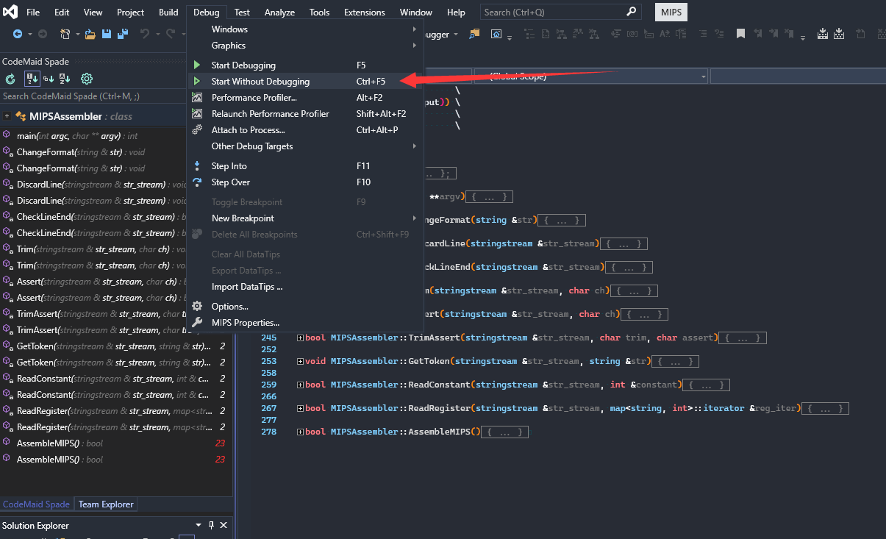

- 若使用较低版本的Visual Studio，可以新建一个空的工程，直接将工程文件夹下的`Source.cpp、my1.asm、my1.txt`复制到工程文件夹下，并在工程中添加`Source.cpp`文件，然后直接按下快捷键<kbd>Ctrl</kbd> + <kbd>F5</kbd>编译并直接运行（不调试）。

- 若要在Visual Studio环境下添加命令行参数，请采取以下步骤：

  1. 在Visual Studio的工程位置点击右键

     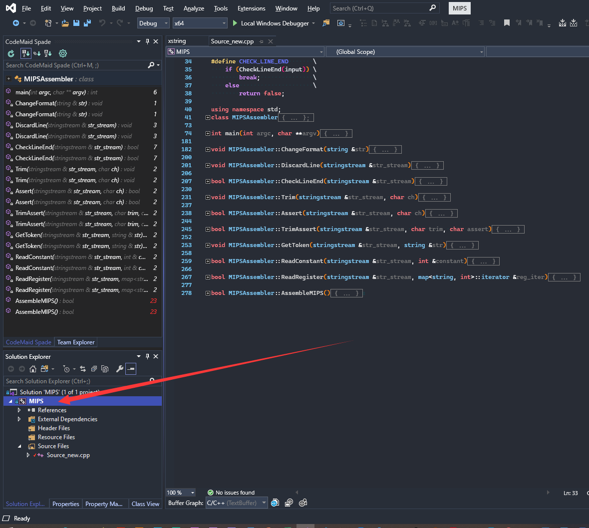

  2. 在弹出的选项卡中选择属性一栏

     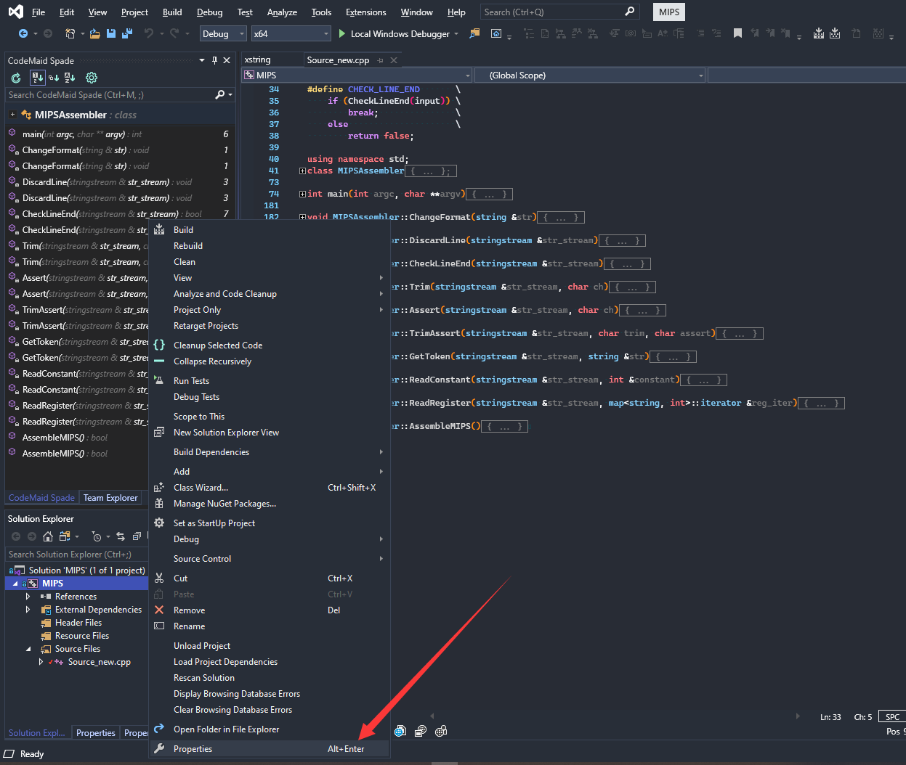

  3. 在弹出的选项中选择调试

     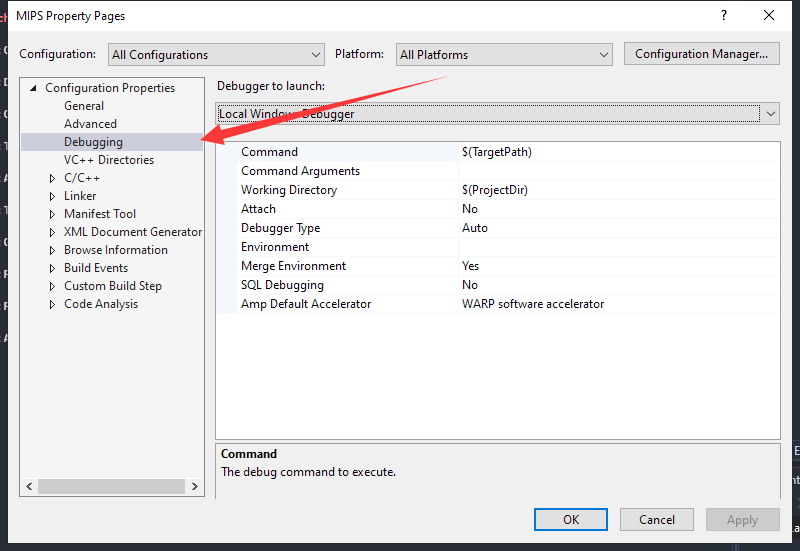

  4. 在右侧的命令行参数中输入需要的命令行参数

     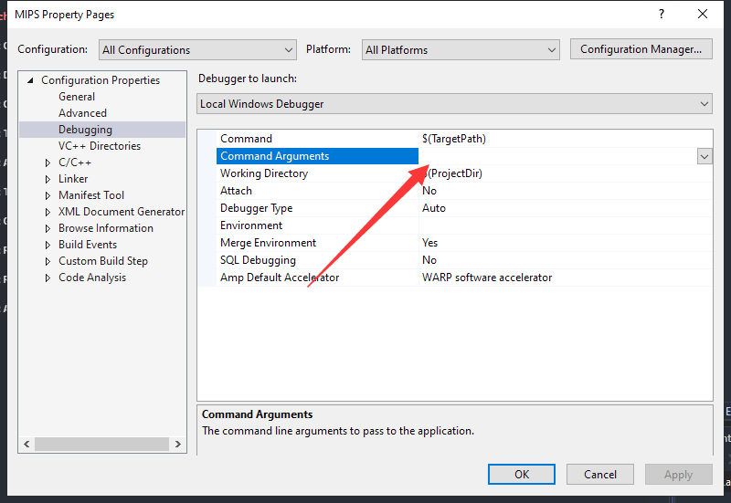

- 若使用其他命令行编译器如GCC，CLANG等，可以直接在源文件所在目录下输入形如如下指令的编译命令：

  ```shell
  # gcc
  gcc Source.cpp -o a.out
  # clang
  clang Source.cpp -o a.out
  ```

  然后直接运行：

  ```shell
  # 保证当前文件夹下有需要的my1.asm文件
  # 且文件的换行方式符合系统要求：Linux LF, Windows CRLF
  ./a.out
  # 或者添加命令行参数
  # 第一个参数为输入文件名
  # 第二个参数为输出文件名
  ./a.out my1.asm my1.txt
  ```

## 2. 题目要求

### 2.1 总体目标

实现MIPS源程序的汇编器（MIPS源程序变机器码，MIPS源程序在文件my1.asm中，生成的机器码文件可放在my1.txt, my1.asm和my1.txt都是文本文件，不是二进制文件，放在你的可执行文件所在目录，下同。my1.asm和my1.txt这两个固定文件名固定不变。）

### 2.2 具体要求

1. 编译器：

   - visual studio 2010--2019版本的微软Visual Studio编译器，编写你的VC++程序。
   - 最近5年发布的Ubuntu Linux的GCC
   - 其他版本的编译器经老师和同学讨论后，决定并公告

   实验报告第1章（或第1节）请说明你所用的编译器及版本，说明你的程序如何编译的各步骤说明。

2. 要求实现第三版教材图2-20的所有指令（见下面图1）、下面图2的`addi`指令、下面图3的`lb`（load byte）和`sb`（store byte）指令，你的汇编源程序可以无实际意义，但每条指令需要出现3次（3者的操作数差别要尽可能大）。对所有指令（共20条），除了系统专用的3个寄存器（`$at,$k1,$k2`）外的29个寄存器，都必须出现2次或以上。

   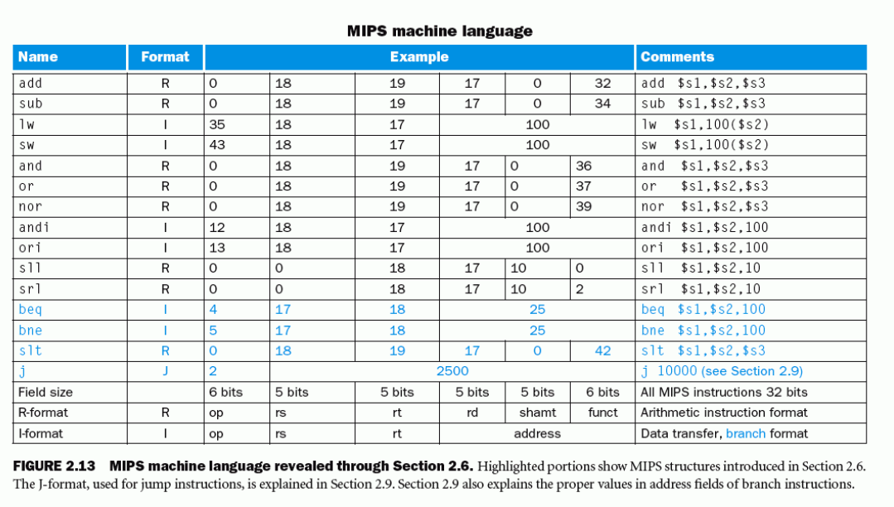

   

   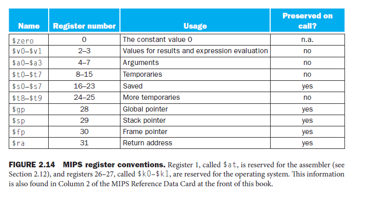

   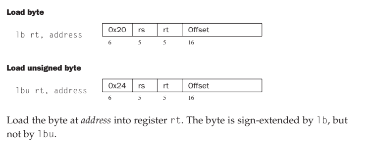

   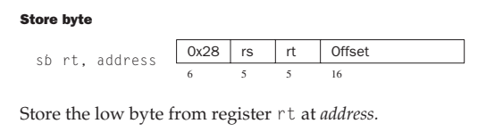

   

3. 要求对实验结果截图，并说明。提交包含源程序的工程文件文件夹（删除`obj`文件及其他大于500KB的编译中间文件，但留下`exe`文件（对Windows系统的Visual Studio）或可执行文件（对Visual Studio之外的系统）、PDF或WORD格式的实验报告、my1.asm、my1.txt文件， 这些文件和目录压缩成一个压缩包文件。

4. my1.txt内容是文本，不是二进制形式的不可见字符（乱码）。My1.txt的典型格式如下：

   ```shell
   1000:10001100 10001001 00000000 00000000    100011 00100 01001 00000 00000 000000
   1004:00000000 00000000 01000000 00100000    000000 00000 00000 01000 00000 100000
      ………
   ```

   上面的标号1000是十进制（16进制也可以），接下去，左边32位是“8位-8位-8位-8位”的机器码，右边32位是“6位-5位-5位-5位-5位-6位”格式的机器码。

5. 你的程序需要能够由助教或老师试运行，会抽查，请提供可执行文件，典型数据文件，实验报告最后一节请提供程序如何运行的使用说明（最好有截图）。

## 3. 实验原理

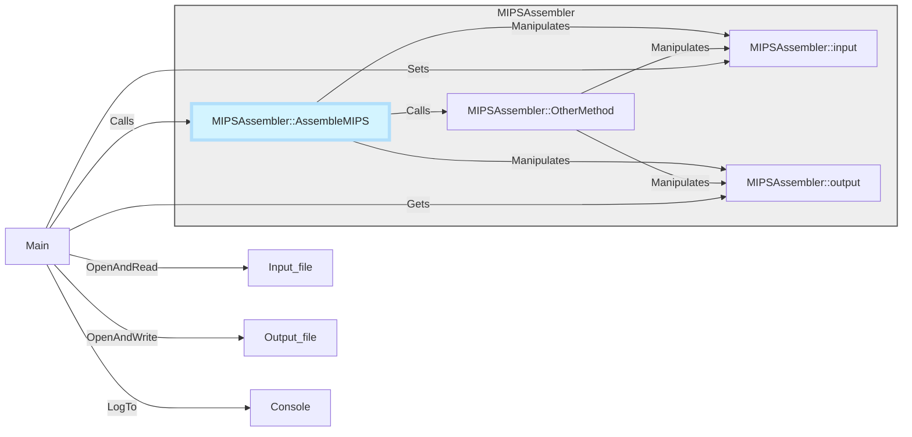
```mermaid
graph LR
	Input_file
	Output_file
	Main
	Console
    subgraph MIPSAssembler
	MIPSAssembler::AssembleMIPS
    MIPSAssembler::input
    MIPSAssembler::output
    MIPSAssembler::OtherMethod
    end
    classDef IMPORTANT_MERMAID fill:#d3f4ff,stroke:#b2dffb,stroke-width:0.3rem,color:#272727
    class MIPSAssembler::AssembleMIPS IMPORTANT_MERMAID
    style MIPSAssembler fill:#eee,stroke:#555,stroke-width:0.1rem

    MIPSAssembler::AssembleMIPS-->|Calls|MIPSAssembler::OtherMethod
    MIPSAssembler::AssembleMIPS-->|Manipulates|MIPSAssembler::input
    MIPSAssembler::OtherMethod-->|Manipulates|MIPSAssembler::input
    MIPSAssembler::AssembleMIPS-->|Manipulates|MIPSAssembler::output
    MIPSAssembler::OtherMethod-->|Manipulates|MIPSAssembler::output
    Main-->|Sets|MIPSAssembler::input
    Main-->|Gets|MIPSAssembler::output
    Main-->|Calls|MIPSAssembler::AssembleMIPS
    Main-->|OpenAndRead|Input_file
    Main-->|OpenAndWrite|Output_file
    Main-->|LogTo|Console
```


### 3.1 头文件与命名空间

```c++
#include <bitset>
#include <fstream>
#include <iomanip>
#include <iostream>
#include <map>
#include <set>
#include <sstream>
#include <string>
#include <vector>

using namespace std;
```

### 3.2 C++面向对象特性的利用

#### `MIPSAssembler`类的属性

我们在实验的实现过程中将汇编器抽象为一个对象。他有如下的属性：

- `struct inst`：一个用于方便的表示一条指令的小结构，包含
  - `format`：指令的结构代码（R，I或J）
  - `op`：指令的操作码
  - `funct`：指令的功能码
  
  ```c++
  // This small structure is for easily declaring different part of an instruction
  struct inst {
      char format; // Format or an instruction(R, I or J)
      int op;      // Opcode of an instruction
      int funct;   // Funct code of an instruction
  };
  ```
  
- `stringstream input, output`：用于储存输入输出数据的字符串流
  - `input`：输入数据流
  - `output`：输出数据流
  
  ```c++
  stringstream input, output;    // string stream for storing input and output
  ```
  
- `map<string, inst> inst_map`：指令集，指令的字符串表示与指令的特征相对应

  ```c++
  map<string, inst> inst_map;    // inst_map: Instruction Map, maps a string representation of an instruction to its corresponding format and opcode/function
  ```

- `map<string, int> reg_map`：寄存器集，寄存器的字符串表示与起数字化表示相对应

  ```c++
  map<string, int> reg_map;      // reg_map: Register Map, maps a string representation of a register to its corresponding register number
  ```

- `int init_line_number = 0x1000`：输出的起始行号，每编码一次指令自增4，以Byte为单位

  ```c++
  set<char> reserved_char;       // Reversed characters that should be considered an end for token recognition
  ```

- `set<string> reserved_char`：保留的字符，本`set`中的所有元素会被认为是一个token的结尾（token不包括该元素）

  - 值得注意是，我们将“#”也作为保留字符，因为我们在`asm`文件中实现了注释（注释以“#”开头）

  ```c++
  set<char> reserved_char;       // Reversed characters that should be considered an end for token recognition
  ```

- `bool Linux_warning = false`：与下面`DiscardLine`中提到的问题相对应

  ```c++
  bool Linux_warning = false;
  ```
  
- `int source_line_number = 1`：用以统计源文件的行号，便于出错后信息的调试

#### `MIPSAssembler`类的方法

汇编器这一对象包含的方法有：

- `void ChangeFormat(string &str)`：将一组未拓展的数据拓展成实验要求的格式，例如
  
  - 从`10001100100010010000000000000000`到`10001100 10001001 00000000 00000000    100011 00100 01001 00000 00000 000000`
  
  ```c++
  void MIPSAssembler::ChangeFormat(string &str)
  {
      str.append(str); // Duplicate string
      /**
       * Add space correspondingly
       * Note that string::insert will insert things at the front of the postion specified
       * that is, inserting at string::end() is legal, while inserting at string::begin() is not
       */
      str.insert(8,       1, ' ');
      str.insert(16 + 1,  1, ' ');
      str.insert(24 + 2,  1, ' ');
      str.insert(32 + 3,  6, ' ');
      str.insert(38 + 9,  1, ' ');
      str.insert(43 + 10, 1, ' ');
      str.insert(48 + 11, 1, ' ');
      str.insert(53 + 12, 1, ' ');
      str.insert(58 + 13, 1, ' ');
  }
  ```
  
- `void DiscardLine(stringstream &str_stream)`：对字符串流进行操作，删除本行（行莫可能是回车或`EOF`）。

  ```c++
  void MIPSAssembler::DiscardLine(stringstream &str_stream)
  {
      source_line_number++;
      while ((str_stream.get() != '\n') && (!str_stream.eof()))
          ;
  }
  ```

- `bool CheckLineEnd(stringstream &str_stream)`：检查当前的字符串流的行结尾是否符合要求。本方法在Linux与Windows平台的表现不同：

  - Windows下默认的回车换行模式是`CRLF`：Carrige Return Line Feed，在文件中储存为两个字符`\r`（0x0A）与`\n`（0x0D），但在各类涉及到字符串交互的操作中，Windows会讲`\n`解释为`\r`，`\n`两个字符。
  - Linux下的回车换行模式是`LF`：Line Feed，在文本中储存为`\n`（0x0D）一个字符，且Linux下的`\n`就会被解释为`\n`，因此在Linux下读取Windows中保存的文件时，如果换行方式为`CRLF`就会出现换行符的读取问题。
  - 在我们的程序中，如果试图在Linux中用Linux下编译的可执行文件读取以`CRLF`方式换行的文件，我们会给出警告，但是汇编工作会继续进行。
  - 如果某个文件是混合模式换行的（既有`CRLF`也有`LF`），在Linux下会得到警告，而Windows会忽略这个问题。
  - 同样的，Windows会将`LF`和`CRLF`模式的文件等同对待。
  - 注意，在`DiscardLine`中其实也会遇到类似的问题，但由于Windows和Linux对`\n`的解读方式不同，程序中这样的写法完全能胜任我们**删除本行**的要求。

  ```c++
  bool MIPSAssembler::CheckLineEnd(stringstream &str_stream)
  {
      Trim(str_stream, ' ');
      if (str_stream.peek() == '#' || str_stream.peek() == '\n') {
          DiscardLine(input);
          return true;
      } else if (str_stream.peek() == '\r') {
          if (!Linux_warning) {
              Linux_warning = true;
              cerr << "WARNING: Processing CRLF file on Linux system." << endl;
          }
          str_stream.get();
          if (str_stream.peek() != '\n') {
              cerr << "FATAL: Carrige Return encountered, however no Line Feed is found, file corrupted." << endl;
              return false;
          }
          DiscardLine(input);
          return true;
      } else if (str_stream.peek() != EOF) {
          cerr << "FATAL: Unexpected line end." << endl;
          return false;
      } else 
          return true;
  }
  ```

- `void Trim(stringstream &str_stream, char ch)`：本方法会将参数中的字符串流接下来的所有`ch`清除掉，直到遇到不同于`ch`的字符。

  ```c++
  void MIPSAssembler::Trim(stringstream &str_stream, char ch)
  {
      while (str_stream.get() == ch) // Will consume an extra character, so we put it back
          ;
      str_stream.unget();
  }
  ```

- `bool Assert(stringstream &str_stream, char ch)`：本方法会检测当前字符串的下一个字符是否为我们认为的，返回`true`如果是，如果不是返回`false`。

  ```c++
  bool MIPSAssembler::Assert(stringstream &str_stream, char ch)
  {
      if (str_stream.get() == ch) return true; // Get next character an validate it
      cerr << "FATAL: Unable to read the character: " << ch << endl;
      return false;
  }
  ```

- `bool TrimAssert(stringstream &str_stream, char trim, char assert)`：本方法用以处理正则表达式``\s*,\s*`会匹配的内容，即空格，逗号，空格，通常见于寄存器间的分隔。也可以用于其他情况的处理，例如`lw`,`sw`等指令的左右括号。

  ```c++
  bool MIPSAssembler::TrimAssert(stringstream &str_stream, char trim, char assert)
  {
      Trim(input, trim);
      if (!Assert(str_stream, assert)) return false;
      Trim(input, trim);
      return true;
  }
  ```

- `void GetToken(stringstream &str_stream, string &str)`：获取一个单字，注意，这个方法不会对空格等进行处理，所以若是没有删除多余的空格，`str`不会获得任何赋值而会被清空，因此本方法一般与`Trim`或者`TrimAssert`连用。

  ```c++
  void MIPSAssembler::GetToken(stringstream &str_stream, string &str)
  {
      str.clear();                                                                     // Clear string buffer
      while (!reserved_char.count(str_stream.peek())) str.push_back(str_stream.get()); // Get char if not reserved
  }
  ```

- `bool ReadRegister(stringstream &str_stream, map<string, int>::iterator &reg_iter)`：`GetToken`并尝试将本寄存器映射到事先定义好的集合里，若失败则会报错。注意，同样不会清空空格，因此一般与`Trim`或者`TrimAssert`连用。

  ```c++
  bool MIPSAssembler::ReadRegister(stringstream &str_stream, map<string, int>::iterator &reg_iter)
  {
      string str;
      GetToken(input, str);
  
      // Return false if we cannot map the string to a register
      if ((reg_iter = reg_map.find(str)) != reg_map.end()) return true;
      cerr << "FATAL: Unable to map register: " << str << " to int value." << endl;
      return false;
  }
  ```

- `bool ReadConstant(stringstream &str_stream, int &constant)`：由于内部实现中用了流操作，因此会去除空格等，但在实际使用该方法的时候，我们还是将其与`Trim`或者`TrimAssert`连用。

  ```c++
  bool MIPSAssembler::ReadConstant(stringstream &str_stream, int &constant)
  {
  
      if ((str_stream >> constant)) return true; // Try interpreting the string into an integer
      cerr << "FATAL: Unable to read the constant." << endl;
      return false;
  }
  ```

- `bool AssembleMIPS()`：核心方法。对输入和输出进行汇编。是本汇编器最主要的函数，通过调用上面列举的各种方法以实现我们需要的逻辑判断，字符匹配，错误处理等。也是本汇编器唯一对外暴露的方法。

  - 关于`AssembleMIPS`的具体实现会在下面宏定义的章节详细阐述。

#### `MIPSAssembler`的完整定义

```c++
class MIPSAssembler
{
    // This small structure is for easily declaring different part of an instruction
    struct inst {
        char format; // Format or an instruction(R, I or J)
        int op;      // Opcode of an instruction
        int funct;   // Funct code of an instruction
    };
    void ChangeFormat(string &str);                                                    // Convert tightly spaced string to the asked form
    void DiscardLine(stringstream &str_stream);                                        // Discard current line until \n or EOF
    bool CheckLineEnd(stringstream &str_stream);                                       // When the recognition of one full instruction is done, check current line for extra char
    void Trim(stringstream &str_stream, char ch);                                      // Discard a certain character, usually space
    bool Assert(stringstream &str_stream, char ch);                                    // return false if the next character is not what we expected
    bool TrimAssert(stringstream &str_stream, char trim, char assert);                 // Trim a certain char, assert if the next is not expected, then trim the char again. Usually for "\s*,\s*"
    void GetToken(stringstream &str_stream, string &str);                              // Get a token until reserved char is encountered. Usually a register
    bool ReadRegister(stringstream &str_stream, map<string, int>::iterator &reg_iter); // Get a token and try to map it to an actual register. Returns false if map is unsuccessful
    bool ReadConstant(stringstream &str_stream, int &constant);                        // Read in a constant. Using stream
    bool Linux_warning = false;

  public:
    /**
     * Using map can give us a clear interface for the instructions in case we want to add or delete or modify them
     * For instructions of format 'J' and 'I', we use 0 to fulfill the empty block that will not be used
     * We've considered using enum, but found it unnecessary
     */
    bool AssembleMIPS();           // Core method and the only method exposed. Returns false if the assembling is unsuccessful
    stringstream input, output;    // string stream for storing input and output
    map<string, inst> inst_map;    // inst_map: Instruction Map, maps a string representation of an instruction to its corresponding format and opcode/function
    map<string, int> reg_map;      // reg_map: Register Map, maps a string representation of a register to its corresponding register number
    set<char> reserved_char;       // Reversed characters that should be considered an end for token recognition
    int init_line_number = 0x1000; // The counter to add at the beginning of a line
    int source_line_number = 1;    // Counter for source code file line number
};
```

### 3.3 宏的利用

在我们的`MIPSAssembler`对象中，最主要的方法是`AssembleMIPS`，然而为了能够正确处理各种不同的错误，本函数的逻辑变得十分复杂。在Visual Studio的Code Maid插件中本方法的复杂度已经到了20。

纵使我们已经利用了C++中的面向对象特性优化了部分复杂之处（本程序的第一个版本（未优化）`AssembleMIPS`的复杂度达到了50，是坚决不可接受的），这一核心函数仍旧有变得整洁的可能性，于是我们使用了C++语言中的宏来让代码变得整洁。

在`AssembleMIPS`中我们定义了如下的宏：

```c++
#define PROCESS_REGISTER(reg_iter) \
    if (!ReadRegister(input, (reg_iter))) return false;

#define PROCESS_FIRST_REGISTER(reg_iter) \
    Trim(input, ' ');                    \
    PROCESS_REGISTER(reg_iter)

#define PROCESS_OTHER_REGISTER(ch, reg_iter)         \
    if (!TrimAssert(input, ' ', (ch))) return false; \
    PROCESS_REGISTER(reg_iter)

#define PROCESS_CONSTANT(width)                       \
    if (!ReadConstant(input, constant)) return false; \
    output << bitset<(width)>(constant);

#define PROCESS_FIRST_CONSTANT(width) \
    Trim(input, ' ');                 \
    PROCESS_CONSTANT(width)

#define PROCESS_OTHER_CONSTANT(ch, width)            \
    if (!TrimAssert(input, ' ', (ch))) return false; \
    PROCESS_CONSTANT(width)
```

使用宏的原因如下：

- 宏就是文字内容的展开，没有额外的堆栈或参数传递问题，没有开销，并且可以对当前范围的变量进行操作。
- 最重要的是，宏可以将函数中包含返回指令的语句简化，这也是本程序经常需要用到的（检测到错误则返回`false`）。
- 用宏相互嵌套可以让函数的逻辑更清晰。剔除复杂的部分，提高程序的抽象程度。

### 3.4 `AssembleMIPS`函数的完整逻辑

程序的详细运行逻辑可以从注释/具体代码看到。

```c++
bool MIPSAssembler::AssembleMIPS()
{
#define PROCESS_REGISTER ...
#define PROCESS_FIRST_REGISTER ...
#define PROCESS_OTHER_REGISTER(ch) ...
#define PROCESS_CONSTANT(width) ...
#define PROCESS_FIRST_CONSTANT(width) ...
#define PROCESS_OTHER_CONSTANT(ch, width) ...
#define CHECK_LINE_END ...

    int constant;                           // A constant
    string str;                             // General purpose string
    map<string, inst>::iterator inst_iter;  // Reserve the result of std::map::find
    map<string, int>::iterator reg_iter_rs; // Reserve the result of std::map::find
    map<string, int>::iterator reg_iter_rt; // Reserve the result of std::map::find
    map<string, int>::iterator reg_iter_rd; // Reserve the result of std::map::find
    while (1) {
        // Skip comment and empty line and discard leading space
        Trim(input, ' ');
        if (input.peek() == '#' || input.peek() == '\n') {
            DiscardLine(input);
            continue;
        } else if (input.peek() == '\r') {
            if (!Linux_warning) {
                Linux_warning = true;
                cerr << "WARNING: Processing CRLF file on Linux system." << endl;
            }
            input.get();
            if (input.peek() != '\n') {
                cerr << "FATAL: Carrige Return encountered, however no Line Feed is found, file corrupted." << endl;
                return false;
            }
            DiscardLine(input);
            continue;
        }

        GetToken(input, str);                                // Try getting the first token(instruction)
        if (str.empty() && input.peek() == EOF) return true; // If the EOF is encountered when trying to get a token, we should stop

        output << setbase(16) << init_line_number << ':'; // Output line number
        init_line_number += 4;                            // Increment the line number

        if ((inst_iter = inst_map.find(str)) == inst_map.end()) {
            cerr << "FATAL: Unable to map instruction: \"" << str << "\" in instruction map." << endl;
            return false;
        }                                            // Return false if we cannot map the string to an instruction
        output << bitset<6>((*inst_iter).second.op); // Output opcode if instruction is found

        switch ((*inst_iter).second.format) {
        case 'R':
            if ((*inst_iter).first == "jr") {

                PROCESS_FIRST_REGISTER(reg_iter_rd)
                output << bitset<5>((*(reg_iter_rd)).second);
                for (int i = 0; i < 3; i++) output << bitset<5>(0); // Zero fill

            } else if (((*inst_iter).first == "sll") || ((*inst_iter).first == "srl")) {

                // Similar implementation as the I format(only these two instructions are of I format)
                output << bitset<5>(0); // First five bit of sll and srl is filled with zero
                PROCESS_FIRST_REGISTER(reg_iter_rt)
                PROCESS_OTHER_REGISTER(',', reg_iter_rs)
                output << bitset<5>((*(reg_iter_rs)).second);
                output << bitset<5>((*(reg_iter_rt)).second);
                PROCESS_OTHER_CONSTANT(',', 5)

            } else {

                // Process the first register
                PROCESS_FIRST_REGISTER(reg_iter_rd)

                // Process two more register
                PROCESS_OTHER_REGISTER(',', reg_iter_rs)
                PROCESS_OTHER_REGISTER(',', reg_iter_rt)
                output << bitset<5>((*(reg_iter_rs)).second);
                output << bitset<5>((*(reg_iter_rt)).second);
                output << bitset<5>((*(reg_iter_rd)).second);
                output << bitset<5>(0); // Output shamt
            }

            // Output funct code of an instruction
            output << bitset<6>((*inst_iter).second.funct);
            break;

        case 'I':

            if (set<string>({"lw", "sw", "lb", "sb"}).count((*inst_iter).first)) {

                PROCESS_FIRST_REGISTER(reg_iter_rt)
                PROCESS_OTHER_CONSTANT(',', 0)
                PROCESS_OTHER_REGISTER('(', reg_iter_rs)
                output << bitset<5>((*(reg_iter_rs)).second);
                output << bitset<5>((*(reg_iter_rt)).second);
                output << bitset<16>(constant);
                if (!TrimAssert(input, ' ', ')')) return false;

            } else {

                PROCESS_FIRST_REGISTER(reg_iter_rt)
                PROCESS_OTHER_REGISTER(',', reg_iter_rs)
                output << bitset<5>((*(reg_iter_rs)).second);
                output << bitset<5>((*(reg_iter_rt)).second);
                PROCESS_OTHER_CONSTANT(',', 16)
            }
            break;

        case 'J':
            Trim(input, ' ');
            // Read in the constant(immediate value)
            if (!ReadConstant(input, constant)) return false;
            output << bitset<26>(constant);
            break;
        }
        if (!CheckLineEnd(input)) return false;
        // Splitting the machine code we've generated
        output << endl;                  // Append a newline for getline to work
        output.seekg(-32 - 1, ios::end); // Change stream input pointer
        getline(output, str);            // Store whole line
        ChangeFormat(str);               // Reformat
        output.seekp(-32 - 1, ios::end); // Change stream output pointer
        output << str;                   // Append the formatted string
        output << endl;                  // previous newline character is consumed by getline
    }
    return true; // Assembly success
}
```

### 3.5 核心思路

#### 指令与寄存器

为让我们的`MIPSAssembler`正常工作，我们在主程序中应首先将其实例化。然后为需要的常数进行赋值：

```c++
// Initializing constants
A.init_line_number = 0x1000;
A.reserved_char = {',', '#', '(', ')', ' ', EOF, '\n', '\r'};
A.inst_map = {
    {"add", {'R', 0, 32}},
    {"sub", {'R', 0, 34}},
    {"lw",  {'I', 35, 0}},
    {"sw",  {'I', 43, 0}},
    {"and", {'R', 0, 36}},
    {"or",  {'R', 0, 37}},
    {"nor", {'R', 0, 39}},
    {"andi",{'I', 12, 0}},
    {"ori", {'I', 13, 0}},
    {"sll", {'R', 0,  0}},
    {"srl", {'R', 0,  2}},
    {"beq", {'I', 4,  0}},
    {"bne", {'I', 5,  0}},
    {"slt", {'R', 0, 42}},
    {"j",   {'J', 2,  0}},
    {"jr",  {'R', 0,  8}},
    {"jal", {'J', 3,  0}},
    {"addi",{'I', 8,  0}},
    {"lb",  {'I', 32, 0}},
    {"sb",  {'I', 40, 0}},
};
A.reg_map = {
    {"$zero",0},
    {"$at",  1},
    {"$v0",  2},
    {"$v1",  3},
    {"$a0",  4},
    {"$a1",  5},
    {"$a2",  6},
    {"$a3",  7},
    {"$t0",  8},
    {"$t1",  9},
    {"$t2", 10},
    {"$t3", 11},
    {"$t4", 12},
    {"$t5", 13},
    {"$t6", 14},
    {"$t7", 15},
    {"$s0", 16},
    {"$s1", 17},
    {"$s2", 18},
    {"$s3", 19},
    {"$s4", 20},
    {"$s5", 21},
    {"$s6", 22},
    {"$s7", 23},
    {"$t8", 24},
    {"$t9", 25},
    {"$k0", 26},
    {"$k1", 27},
    {"$gp", 28},
    {"$sp", 29},
    {"$fp", 30},
    {"$ra", 31},
};
```

注意，在`inst_map`中我们对I类和J的指令的`funct`域也进行了赋值，虽然他们在实际的汇编过程中不会被使用。

#### 文件名（输入输出）

我们使用了命令行参数，当然，如果你选择不使用参数或者只使用一个，没有被赋值的文件名会采用默认值。

赋值的顺序是第一个参数对应输入文件名，第二个参数对应输出文件名。

他们的默认值分别为：

1. 输入：`my1.asm`
2. 输出：`my1.txt`

```c++
int main(int argc, char **argv)
{
    string input_file_name = "my1.asm";
    string output_file_name = "my1.txt";
    if (argc >= 2) input_file_name = argv[1];
    if (argc >= 3) output_file_name = argv[2];
    MIPSAssembler A;                       // Instantiate the MIPS assembler
    ifstream my1asm_file(input_file_name); // open input file
    if (!my1asm_file.is_open()) {
        cerr << "FATAL: Unable to open the file specified";
        return 2;
    }
    A.input << my1asm_file.rdbuf(); // load filestream content
    my1asm_file.close();            // Close input file

    // Open output file
    ofstream my1txt_file(output_file_name);
    if (!my1txt_file.is_open()) {
        cerr << "FATAL: Unable to open the file specified.";
        return 3;
    }
    ...
    ...
}
```

#### 错误传递

在本程序中，错误是通过返回值（布尔值）传递的。例如：

- `main`函数发现`AssembleMIPS`返回`false`就知道汇编失败了，会进行DUMP等一系列操作：

  ```c++
          cerr << "FATAL: Illegal instruction or format. Check your syntax." << endl; // Error prompt
          A.output.seekg(0, ios::beg);                                                // Change output stream pointer position
          cout << "DUMP: Current line of input stringstream is:" << endl;             // Dump current input string stream
          A.input.clear();
          while (A.input.peek() != '\n' && A.input.tellg()) A.input.unget();
          A.input.get();
          string buffer;
          getline(A.input, buffer);
          cout << buffer << endl;                                                  // Dump current input line
          cout << "DUMP: Current line number is: " << A.source_line_number << endl; // Dump current line number
          cout << "DUMP: Current buffer of output stringstream is:" << endl;       // Dump current output string stream
          cout << A.output.rdbuf() << endl;                                        // Dump current output string stream
  
          output_file << A.output.rdbuf(); // Dump the stringstream to file
          output_file.close();             // Close output file
          return 1;
  ```
  
- 如果返回`true`则进行字符串流转换，关闭打开的文件等操作：

  ```c++
  A.output.seekg(0, ios::beg);            // Change output stream pointer position
  output_file << A.output.rdbuf();        // Save output string stream to file stream
  output_file.close();                    // Close output file
  cout << "Assembly successful." << endl; // Successful prompt
  cout << "Input file is: \"" << input_file_name << '\"' << endl;
  cout << "Output file is: \"" << output_file_name << '\"' << endl;
  return 0;
  ```

- 同样的，在`AssembleMIPS`函数中，各种不同的调用之间也通过`bool`类型的返回值进行交流。

#### 字符串流的使用

在本程序中，我们使用了字符串流这一种储存在内存中的对象。虽然它的各种操作和文件流类似，但是使用字符串流给了我们快速操作的可能。（读取内存中的内容远比读取硬盘上的文件快得多）

并且结合着面向对象的思想，我们完全可以在读取文件非常大的时候将输入在`main`函数中分割，并多次调用`AssembleMIPS`，这样就实现了大文件的处理。（在现在的版本中暂时没有进行这样的操作，但这种设计方式给了我们这样操作的可能性）

## 4. 实验过程与结果

### 4.1 编写源码

在代码编辑器中编写上述源码。

- 编写好代码框架

  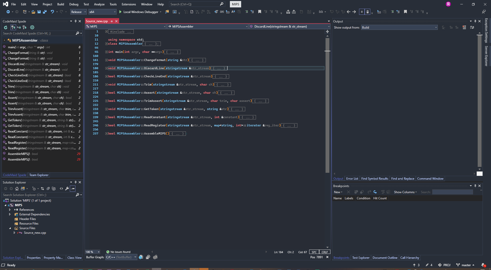

- 添加具体内容

  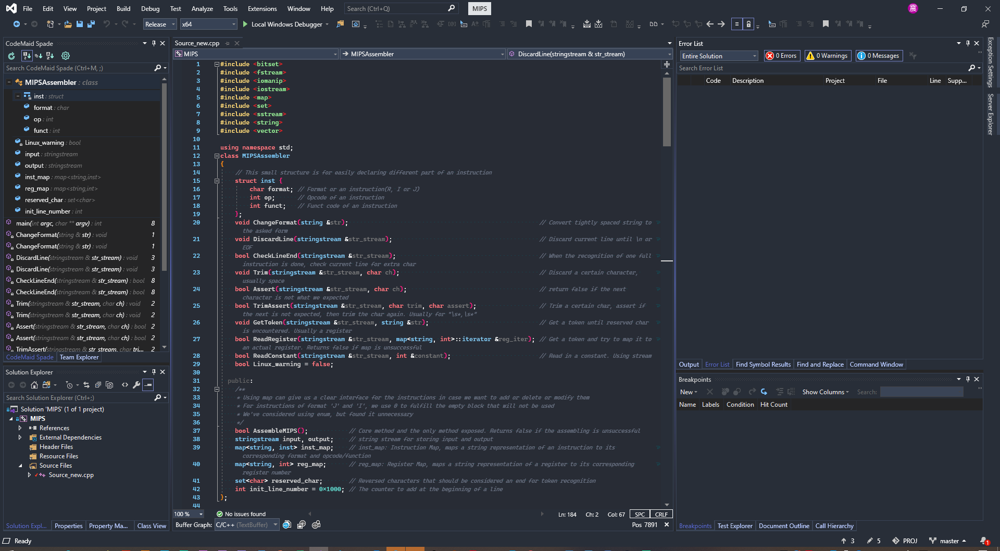

  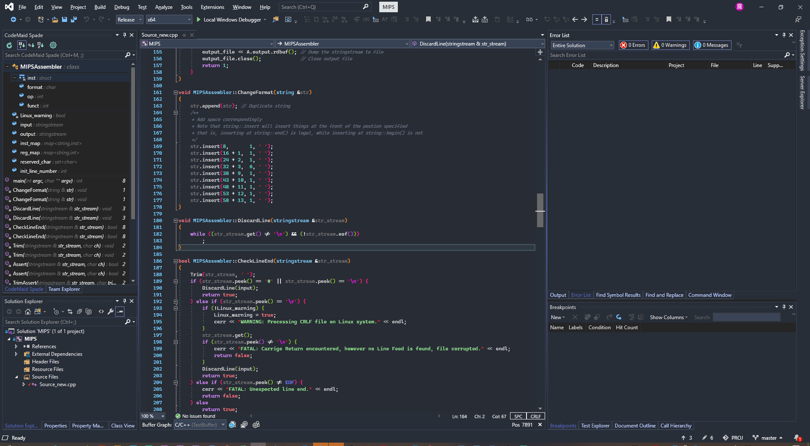

  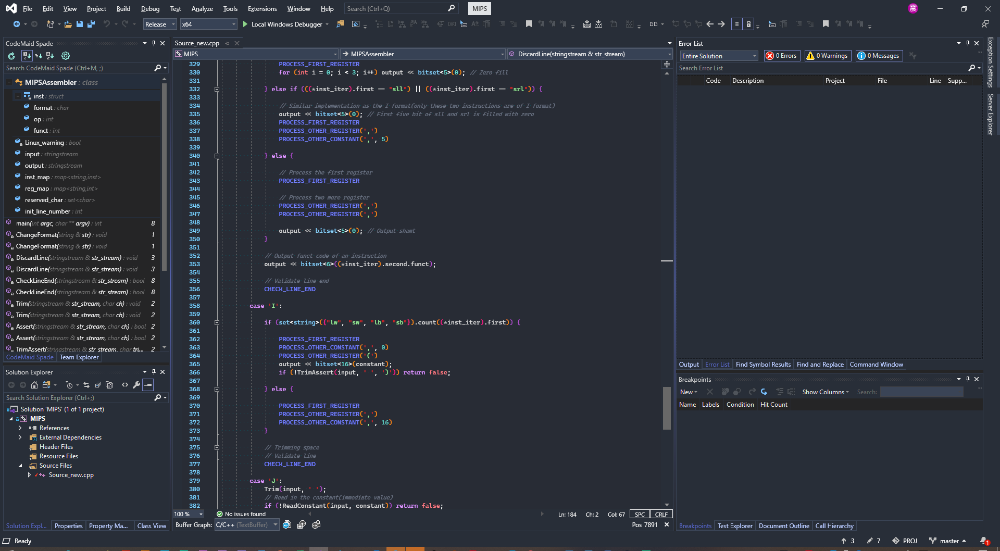

### 4.2 编写测试数据并测试

#### 正常输入

以普通格式测试所有涉及到的指令和寄存器以及常数输入。

- 注意在此测试数据中，我们同时测试了空行和注释功能。

```assembly
# All implemented instructions and registers test
add  $v0, $v1, $zero
sub  $a0, $a1, $a2
and  $a3, $t0, $t1
or   $t2, $t3, $t4
nor  $t5, $t6, $t7
slt  $s0, $s1, $s2

add  $s3, $s4, $s5
sub  $s6, $s7, $t8
and  $t9, $gp, $sp
or   $fp, $ra, $zero
nor  $v0, $v1, $zero
slt  $a0, $a1, $a2

add  $a3, $t0, $t1
sub  $t2, $t3, $t4
and  $t5, $t6, $t7
or   $s0, $s1, $s2
nor  $s0, $s1, $s2
slt  $s6, $s7, $t8

add  $t9, $gp, $sp
sub  $fp, $ra, $zero
and  $v0, $v1, $zero
or   $a0, $a1, $a2
nor  $a3, $t0, $t1
slt  $t2, $t3, $t4

andi $t9, $gp,  1
ori  $s7, $t8,  1
sll  $s5, $s6,  1
srl  $s3, $s4,  1
beq  $s1, $s2,  1
bne  $t7, $s0,  1
addi $t5, $t6,  1

andi $t3, $t4,  10
ori  $t1, $t2,  10
sll  $a3, $t0,  10
srl  $a1, $a2,  10
beq  $a0, $zero,10
bne  $v0, $v1,  10
addi $ra, $zero,10

andi $sp, $fp,  -100
ori  $t9, $gp,  -100
sll  $s7, $t8,  -100
srl  $s5, $s6,  -100
beq  $s3, $s4,  -100
bne  $s1, $s2,  -100
addi $t7, $s0,  -100

andi $t5, $t6,  1000
ori  $t3, $t4,  1000
sll  $t1, $t2,  1000
srl  $a3, $t0,  1000
beq  $a1, $a2,  1000
bne  $a0, $zero,1000
addi $v0, $v1,  1000


sw   $v0, 10($v1)
lw   $a0, 10($zero)
lb   $a1, 10($a2)
sb   $a3, 10($t0)
 
sw   $t1, 100($t2)
lw   $t3, 100($t4)
lb   $t5, 100($t6)
sb   $t7, 100($s0)
 
sw   $s1, 1000($s2)
lw   $s3, 1000($s4)
lb   $s5, 1000($s6)
sb   $s7, 1000($t8)
 
sw   $t9, 1($gp)
lw   $sp, 1($fp)
lb   $ra, 1($zero)
sb   $v0, 1($v1)

jr   $v0
jr   $s0
jr   $t0
jr   $zero

j    1
jal  2

j    -3
jal  -4

j    500
jal  600

j    1000
jal  -1000
```

运行截图：

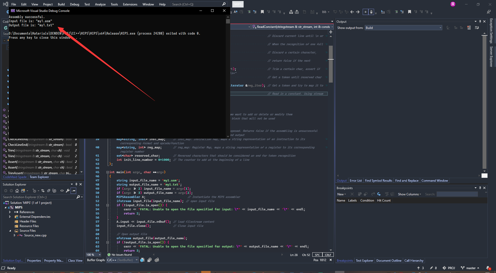

输入文件内容截图：

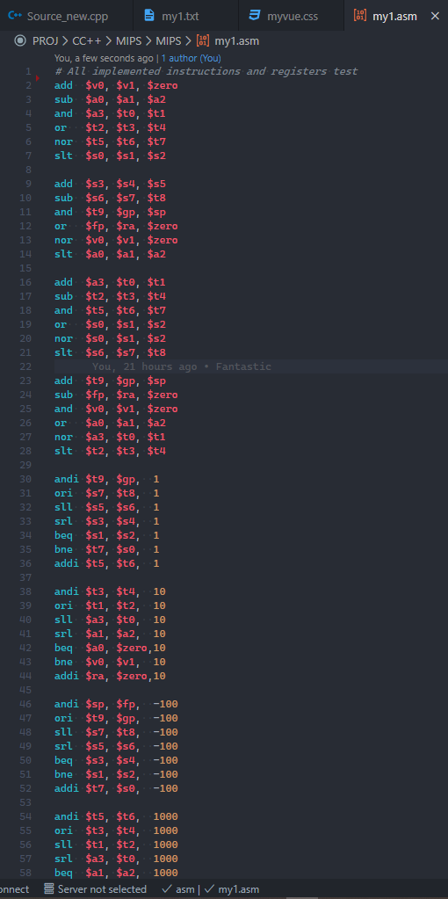

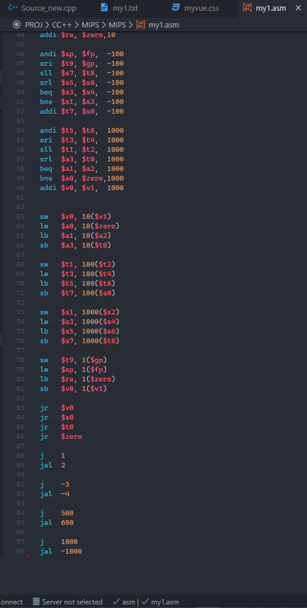

汇编结果：

```log
1000:00000010 00110010 10000000 00100000      000000 10001 10010 10000 00000 100000
1004:00000010 00110010 10000000 00100000      000000 10001 10010 10000 00000 100000
1008:00000010 00110010 10000000 00100000      000000 10001 10010 10000 00000 100000
100c:00000010 00110010 10000000 00100000      000000 10001 10010 10000 00000 100000
1010:00000010 00110010 10000000 00100000      000000 10001 10010 10000 00000 100000
1014:00000010 00110010 10000000 00100000      000000 10001 10010 10000 00000 100000
1018:10001101 01001000 00000000 01100100      100011 01010 01000 00000 00001 100100
101c:10001101 01001000 00000000 01100100      100011 01010 01000 00000 00001 100100
1020:10001101 01001000 00000000 01100100      100011 01010 01000 00000 00001 100100
1024:10000001 01001000 00000000 01100100      100000 01010 01000 00000 00001 100100
1028:10101101 01001000 00000000 01100100      101011 01010 01000 00000 00001 100100
102c:10000001 01001000 00000000 01100100      100000 01010 01000 00000 00001 100100
1030:10100001 01001000 00000000 01100100      101000 01010 01000 00000 00001 100100
1034:00000011 11100000 00000000 00001000      000000 11111 00000 00000 00000 001000
1038:00000011 11100000 00000000 00001000      000000 11111 00000 00000 00000 001000
103c:00000011 11100000 00000000 00001000      000000 11111 00000 00000 00000 001000
1040:00001000 00000000 10011100 01000000      000010 00000 00000 10011 10001 000000
1044:00001100 00000000 00000001 10010000      000011 00000 00000 00000 00110 010000
1048:00100000 01100010 00100111 00010000      001000 00011 00010 00100 11100 010000
104c:00000000 00001010 01001010 10000000      000000 00000 01010 01001 01010 000000
1050:00000000 00001010 01001010 10000010      000000 00000 01010 01001 01010 000010
1054:00000000 01100000 00010000 00100000      000000 00011 00000 00010 00000 100000
1058:00000000 10100110 00100000 00100010      000000 00101 00110 00100 00000 100010
105c:00000001 00001001 00111000 00100100      000000 01000 01001 00111 00000 100100
1060:00000001 01101100 01010000 00100101      000000 01011 01100 01010 00000 100101
1064:00000001 11001111 01101000 00100111      000000 01110 01111 01101 00000 100111
1068:00000010 00110010 10000000 00101010      000000 10001 10010 10000 00000 101010
106c:00000010 10010101 10011000 00100000      000000 10100 10101 10011 00000 100000
1070:00000010 11111000 10110000 00100010      000000 10111 11000 10110 00000 100010
1074:00000011 10011101 11001000 00100100      000000 11100 11101 11001 00000 100100
1078:00000011 11100000 11110000 00100101      000000 11111 00000 11110 00000 100101
107c:00000000 01100000 00010000 00100111      000000 00011 00000 00010 00000 100111
1080:00000000 10100110 00100000 00101010      000000 00101 00110 00100 00000 101010
1084:00000001 00001001 00111000 00100000      000000 01000 01001 00111 00000 100000
1088:00000001 01101100 01010000 00100010      000000 01011 01100 01010 00000 100010
108c:00000001 11001111 01101000 00100100      000000 01110 01111 01101 00000 100100
1090:00000010 00110010 10000000 00100101      000000 10001 10010 10000 00000 100101
1094:00000010 00110010 10000000 00100111      000000 10001 10010 10000 00000 100111
1098:00000010 11111000 10110000 00101010      000000 10111 11000 10110 00000 101010
109c:00000011 10011101 11001000 00100000      000000 11100 11101 11001 00000 100000
10a0:00000011 11100000 11110000 00100010      000000 11111 00000 11110 00000 100010
10a4:00000000 01100000 00010000 00100100      000000 00011 00000 00010 00000 100100
10a8:00000000 10100110 00100000 00100101      000000 00101 00110 00100 00000 100101
10ac:00000001 00001001 00111000 00100111      000000 01000 01001 00111 00000 100111
10b0:00000001 01101100 01010000 00101010      000000 01011 01100 01010 00000 101010
10b4:00110011 10011001 00000000 00000001      001100 11100 11001 00000 00000 000001
10b8:00110111 00010111 00000000 00000001      001101 11000 10111 00000 00000 000001
10bc:00000000 00010110 10101000 01000000      000000 00000 10110 10101 00001 000000
10c0:00000000 00010100 10011000 01000010      000000 00000 10100 10011 00001 000010
10c4:00010010 01010001 00000000 00000100      000100 10010 10001 00000 00000 000100
10c8:00010110 00001111 00000000 00000100      000101 10000 01111 00000 00000 000100
10cc:00100001 11001101 00000000 00000001      001000 01110 01101 00000 00000 000001
10d0:00110001 10001011 00000000 00001010      001100 01100 01011 00000 00000 001010
10d4:00110101 01001001 00000000 00001010      001101 01010 01001 00000 00000 001010
10d8:00000000 00001000 00111010 10000000      000000 00000 01000 00111 01010 000000
10dc:00000000 00000110 00101010 10000010      000000 00000 00110 00101 01010 000010
10e0:00010000 00000100 00000000 00101000      000100 00000 00100 00000 00000 101000
10e4:00010100 01100010 00000000 00101000      000101 00011 00010 00000 00000 101000
10e8:00100000 00011111 00000000 00001010      001000 00000 11111 00000 00000 001010
10ec:00110011 11011101 11111111 10011100      001100 11110 11101 11111 11110 011100
10f0:00110111 10011001 11111111 10011100      001101 11100 11001 11111 11110 011100
10f4:00000000 00011000 10111111 00000000      000000 00000 11000 10111 11100 000000
10f8:00000000 00010110 10101111 00000010      000000 00000 10110 10101 11100 000010
10fc:00010010 10010011 11111110 01110000      000100 10100 10011 11111 11001 110000
1100:00010110 01010001 11111110 01110000      000101 10010 10001 11111 11001 110000
1104:00100010 00001111 11111111 10011100      001000 10000 01111 11111 11110 011100
1108:00110001 11001101 00000011 11101000      001100 01110 01101 00000 01111 101000
110c:00110101 10001011 00000011 11101000      001101 01100 01011 00000 01111 101000
1110:00000000 00001010 01001010 00000000      000000 00000 01010 01001 01000 000000
1114:00000000 00001000 00111010 00000010      000000 00000 01000 00111 01000 000010
1118:00010000 11000101 00001111 10100000      000100 00110 00101 00001 11110 100000
111c:00010100 00000100 00001111 10100000      000101 00000 00100 00001 11110 100000
1120:00100000 01100010 00000011 11101000      001000 00011 00010 00000 01111 101000
1124:10101100 01100010 00000000 00001010      101011 00011 00010 00000 00000 001010
1128:10001100 00000100 00000000 00001010      100011 00000 00100 00000 00000 001010
112c:10000000 11000101 00000000 00001010      100000 00110 00101 00000 00000 001010
1130:10100001 00000111 00000000 00001010      101000 01000 00111 00000 00000 001010
1134:10101101 01001001 00000000 01100100      101011 01010 01001 00000 00001 100100
1138:10001101 10001011 00000000 01100100      100011 01100 01011 00000 00001 100100
113c:10000001 11001101 00000000 01100100      100000 01110 01101 00000 00001 100100
1140:10100010 00001111 00000000 01100100      101000 10000 01111 00000 00001 100100
1144:10101110 01010001 00000011 11101000      101011 10010 10001 00000 01111 101000
1148:10001110 10010011 00000011 11101000      100011 10100 10011 00000 01111 101000
114c:10000010 11010101 00000011 11101000      100000 10110 10101 00000 01111 101000
1150:10100011 00010111 00000011 11101000      101000 11000 10111 00000 01111 101000
1154:10101111 10011001 00000000 00000001      101011 11100 11001 00000 00000 000001
1158:10001111 11011101 00000000 00000001      100011 11110 11101 00000 00000 000001
115c:10000000 00011111 00000000 00000001      100000 00000 11111 00000 00000 000001
1160:10100000 01100010 00000000 00000001      101000 00011 00010 00000 00000 000001
1164:00000000 01000000 00000000 00001000      000000 00010 00000 00000 00000 001000
1168:00000010 00000000 00000000 00001000      000000 10000 00000 00000 00000 001000
116c:00000001 00000000 00000000 00001000      000000 01000 00000 00000 00000 001000
1170:00000000 00000000 00000000 00001000      000000 00000 00000 00000 00000 001000
1174:00001000 00000000 00000000 00000100      000010 00000 00000 00000 00000 000100
1178:00001100 00000000 00000000 00001000      000011 00000 00000 00000 00000 001000
117c:00001011 11111111 11111111 11110100      000010 11111 11111 11111 11111 110100
1180:00001111 11111111 11111111 11110000      000011 11111 11111 11111 11111 110000
1184:00001000 00000000 00000111 11010000      000010 00000 00000 00000 11111 010000
1188:00001100 00000000 00001001 01100000      000011 00000 00000 00001 00101 100000
118c:00001000 00000000 00001111 10100000      000010 00000 00000 00001 11110 100000
1190:00001111 11111111 11110000 01100000      000011 11111 11111 11110 00001 100000
```


#### 各种错误情况

##### Linux下使用Windows的`CRLF`换行方式

  等级：WARNING

  输入文件内容

  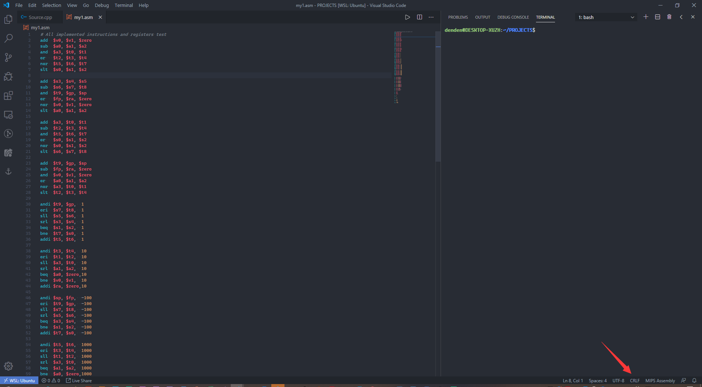

  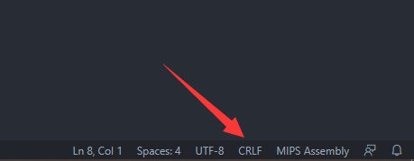

  控制台输出

  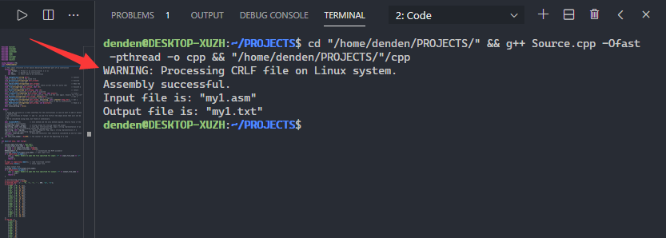

##### 错误（不规范）的语法

  各类警告错误的列举

  ```assembly
  # Implemented comment character '#' for marker in the asm file
          # When '#' is encountered, the entire line will be ignored
  # Tester for irregular input, like trailing space or space every where
        add $s0,$s1,$s2
  add $s0, $s1, $s2
  add $s0, $s1, $s2
  add $s0,            $s1, $s2
  add $s0, $s1, $s2
  add $s0, $s1, $s2
   lw $t0,  100(               $t2           )
  lw $t0,      100( $t2 )    
  lw $t0, 100( $t2 )
      lb $t0, 100( $t2 )
  sw $t0, 100( $t2 )
  lb $t0, 100( $t2 )
  sb $t0, 100( $t2 )
    jr $ra
  jr $ra
  jr $ra
  j 10000
   jal 100
     addi $v0, $v1, 10000 # This is some inline comment, please ignore me
  sll $t1, $t2, 10
  srl $t1, $t2, 10
  ```

  输入文件的截图

  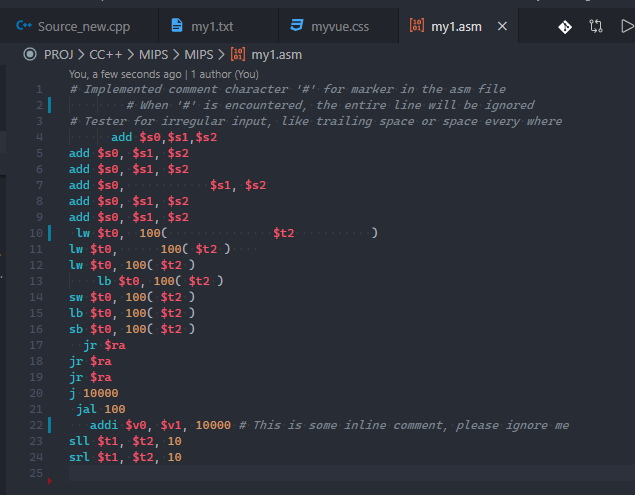

  输出文件

  ```log
1000:00000010 00110010 10000000 00100000      000000 10001 10010 10000 00000 100000
1004:00000010 00110010 10000000 00100000      000000 10001 10010 10000 00000 100000
1008:00000010 00110010 10000000 00100000      000000 10001 10010 10000 00000 100000
100c:00000010 00110010 10000000 00100000      000000 10001 10010 10000 00000 100000
1010:00000010 00110010 10000000 00100000      000000 10001 10010 10000 00000 100000
1014:00000010 00110010 10000000 00100000      000000 10001 10010 10000 00000 100000
1018:10001101 01001000 00000000 01100100      100011 01010 01000 00000 00001 100100
101c:10001101 01001000 00000000 01100100      100011 01010 01000 00000 00001 100100
1020:10001101 01001000 00000000 01100100      100011 01010 01000 00000 00001 100100
1024:10000001 01001000 00000000 01100100      100000 01010 01000 00000 00001 100100
1028:10101101 01001000 00000000 01100100      101011 01010 01000 00000 00001 100100
102c:10000001 01001000 00000000 01100100      100000 01010 01000 00000 00001 100100
1030:10100001 01001000 00000000 01100100      101000 01010 01000 00000 00001 100100
1034:00000011 11100000 00000000 00001000      000000 11111 00000 00000 00000 001000
1038:00000011 11100000 00000000 00001000      000000 11111 00000 00000 00000 001000
103c:00000011 11100000 00000000 00001000      000000 11111 00000 00000 00000 001000
1040:00001000 00000000 10011100 01000000      000010 00000 00000 10011 10001 000000
1044:00001100 00000000 00000001 10010000      000011 00000 00000 00000 00110 010000
1048:00100000 01100010 00100111 00010000      001000 00011 00010 00100 11100 010000
104c:00000000 00001010 01001010 10000000      000000 00000 01010 01001 01010 000000
1050:00000000 00001010 01001010 10000010      000000 00000 01010 01001 01010 000010
  ```

  各类致命错误语法的列举

  ```assembly
  # Extra comma
  # add $s0, $s1, $s2,
  # add $s0, $s1,, $s2
  
  # Unrecognized instruction
  # abc $s0, $s1, $s2
  
  # Unrecognized register
  # add $abc,$s1, $s2
  
  # Wrong syntax(Unable to match with already defined syntax)
  # add  $v0, $v1, $zero,
  # add  $v0, $v1
  # add  $v0, $v1, 100
  # add  100, $v0, $v1
  # 
  # andi $t9, $gp, 100,
  # andi $t9, $gp,
  # andi $t9, $gp, $s0
  # andi $t9, 100
  # andi 100, $t1
  # 
  # sw  $v0, 10($v1
  # sw  $v0, 10$v1)
  # sw  $v0, 10($v1),
  # sw  $v0, 10($v1), 10
  # 
  # j    1,
  # j    $v1
  # j    ,
  # j    1,1
  # 
  # jr   $v0,
  # jr   0
  # jr   $v0, 10
  # jr   $v0, $v1
  ```

  - 额外的逗号

    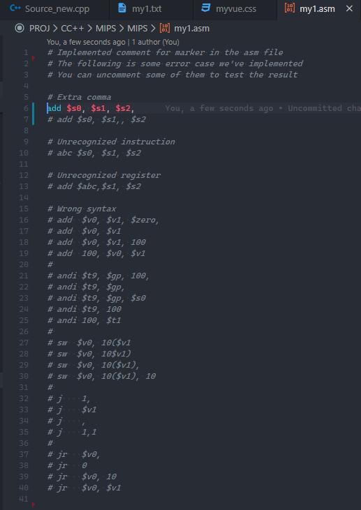

    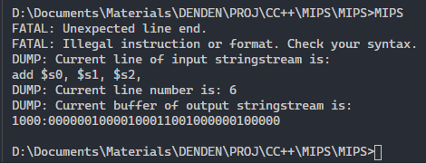

    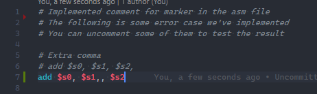

    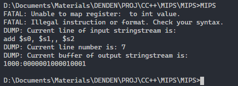

  - 无法识别的指令

    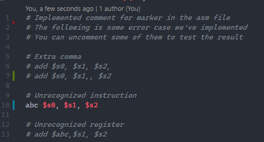
  
    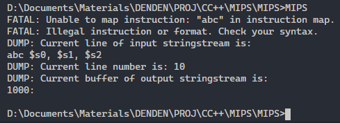
  
  - 无法识别的寄存器
  
    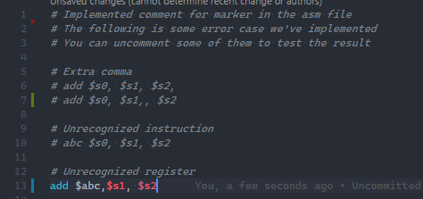
  
    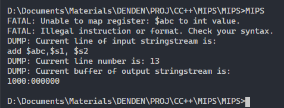
    
  - 错误的指令格式（部分）
    
    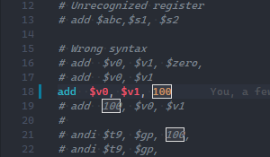
    
    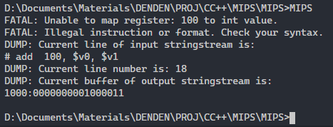
    
    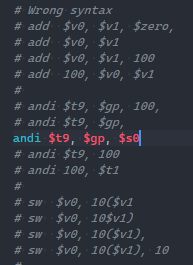
    
    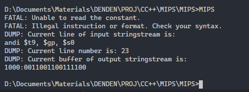
    
    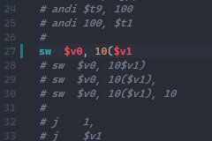
    
    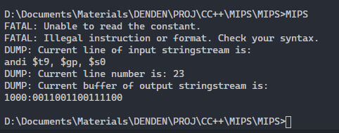
    
    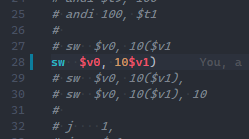
    
    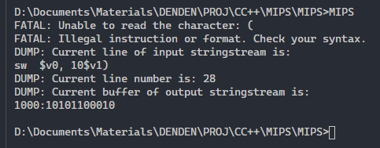
    
    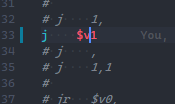
    
    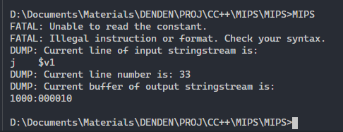
    
    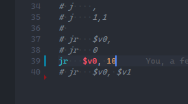
    
    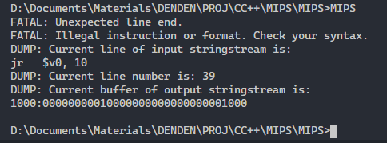
    
